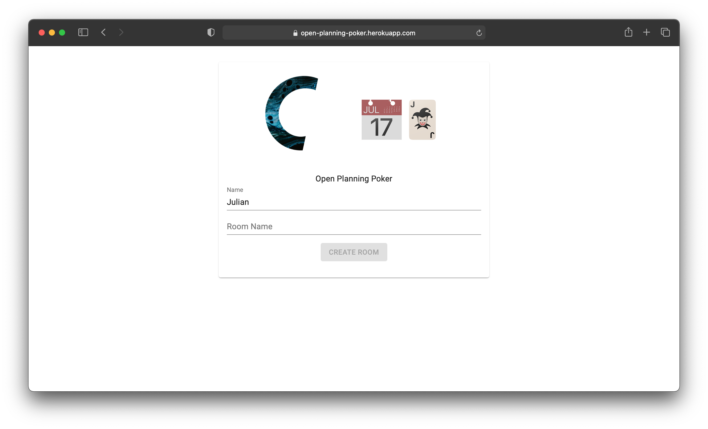
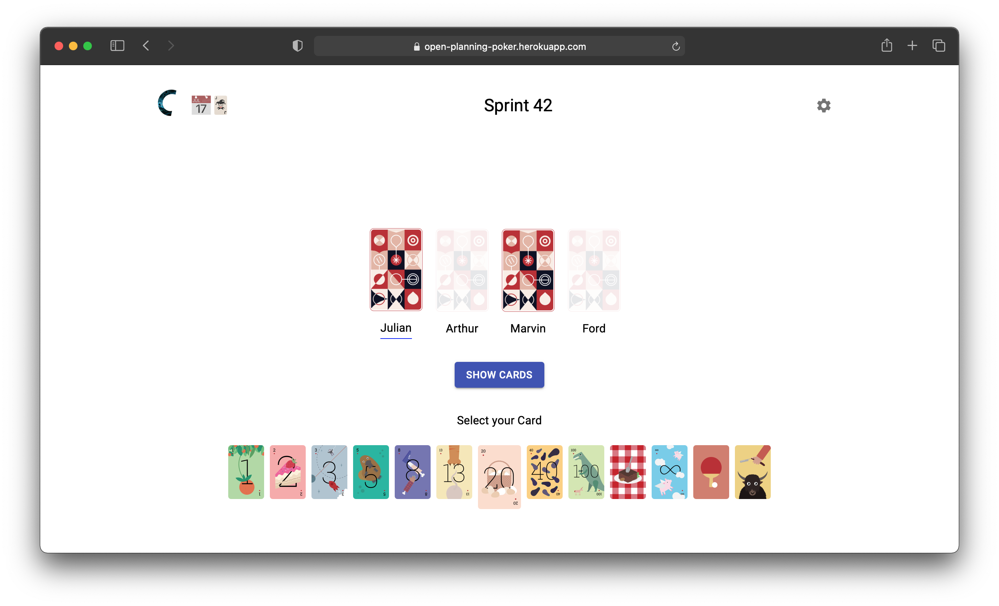
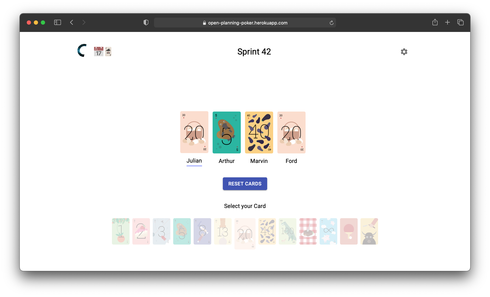

# open-planning-poker

Online Planning poker that uses the [Planning Poker cards by Redbooth](https://github.com/redbooth/scrum-poker-cards).

Hosted on [render](render.com). -> https://open-planning-poker.onrender.com





## Building and running on localhost

```sh
$ npm run build
$ npm run start
```

## Developing on localhost

### Frontend
With hot reload.
```sh
$ cd frontend
$ npm run dev
```

### Backend
With hot reload.
```sh
$ cd server
$ npm run dev
```

```sh
$ cd frontend
$ npm run start
```

Visit: http://localhost:3000

## Run as Container

### Get the Docker image
You can use the public image
```sh
$ docker pull ghcr.io/d-portenier/open-planning-poker:latest
```
or build it yoursefl
```sh
$ docker build -t <container-name> .
```

### Run the container
```sh
$ docker run -p 3000:3000 -d <container-name>
```
Use whatever name as <container-name> you have used when building the image. If you have pulled the image from the registry, use ghcr.io/d-portenier/open-planning-poker as \<container-name\>.

Visit: http://localhost:3000

## Credits

[Planning Poker cards by Redbooth](https://github.com/redbooth/scrum-poker-cards)
